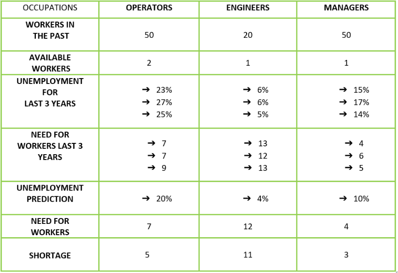

# OKULARY
Okulary is a company devoted to the manufacturing of sunglasses with 3Dprinters. All the materias are recycled and we follow a sustainable production process.
 
## INDUSTRY
The industry of our company is the Ophtilmatic Goods Manufacturing. NAICS code 33915.
In the industry, there are 955 business manufacturing nowadays.
Some examples of products of this industry are:
- Contact lenses
- Sunglasses
- Eyeglass frame

## PRODUCTION PROCESS

## OUR JOBS

## ESTIMATIONS
 

## JOB OFFERS
 
 
 
 

